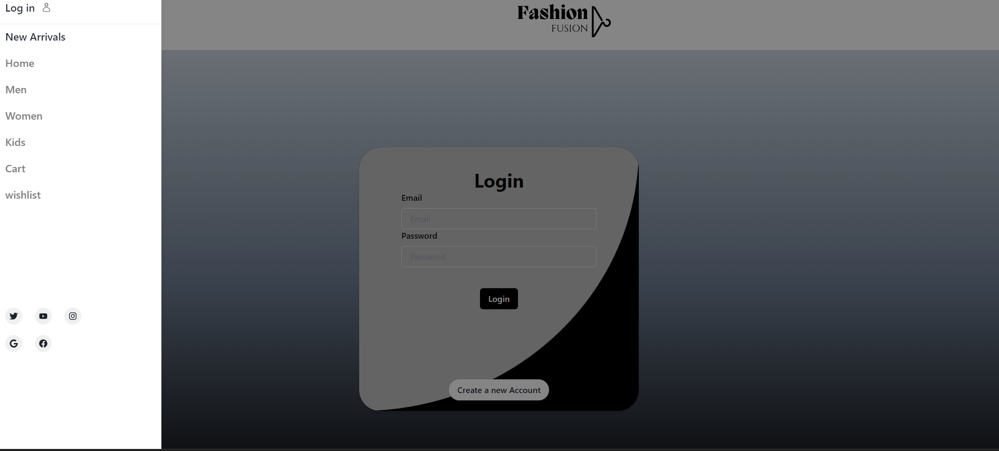
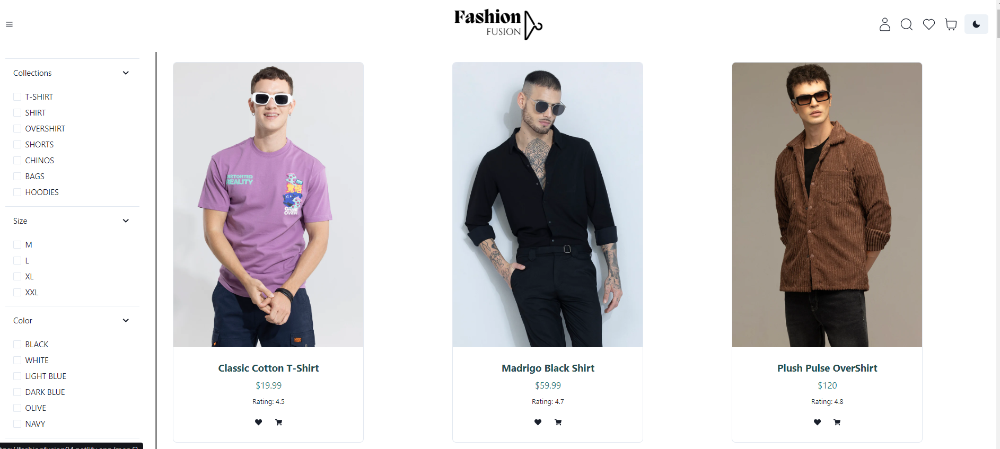
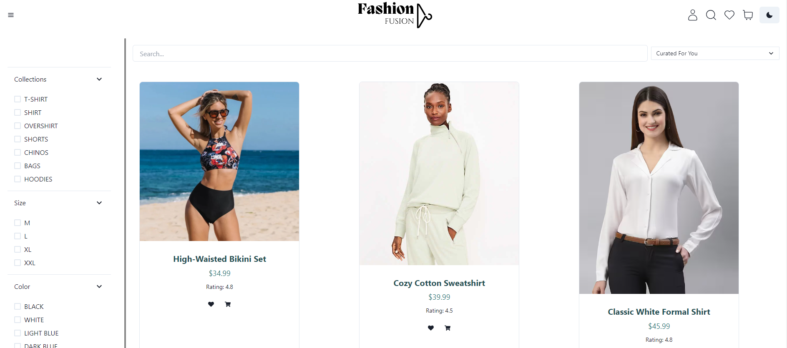
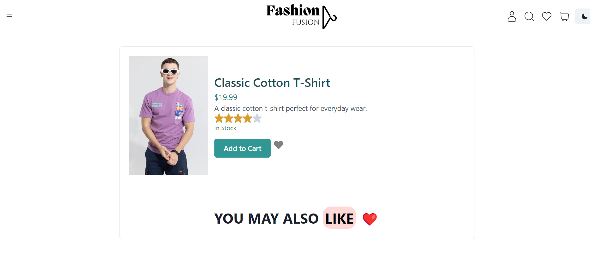
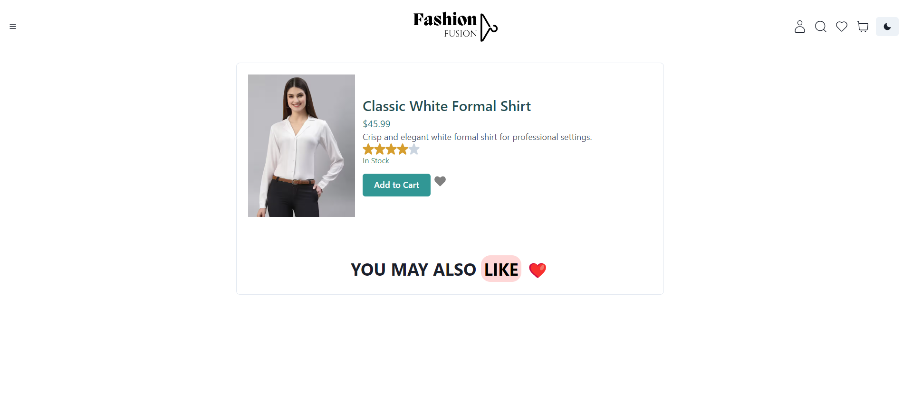
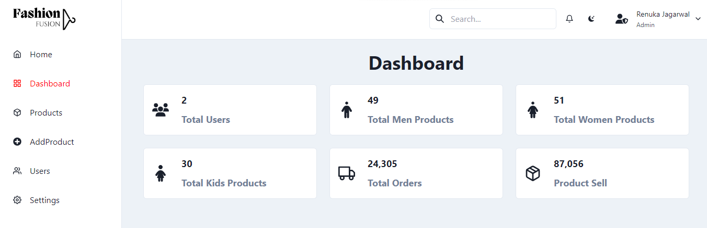
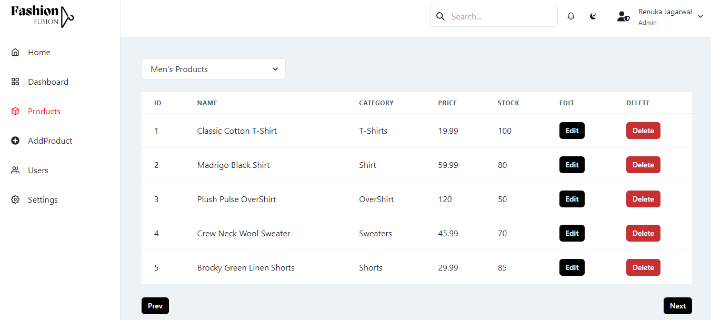

# FashionFusion

## Introduction

FashionFusion is designed to provide a seamless and enjoyable shopping experience for fashion enthusiasts. From trendy apparel to chic accessories, FashionFusion brings the latest styles to your fingertips. This project not only showcases a visually appealing user interface but also incorporates essential features for a complete e-commerce solution.

## Project Type

Full Stack

## Deplolyed App

Frontend: 
Backend: https://mock-server-app-1.onrender.com/

## Video Walkthrough of the project

Project-Presentation Link:

## Features
  Intuitive User Interface: A clean and user-friendly interface to enhance the browsing and shopping experience.
   
  User Authentication: Secure user registration and login.

  Product Catalog: Explore a diverse range of fashion items conveniently categorized for easy navigation.

  Shopping Cart: Effortlessly add and manage your favorite items with an interactive shopping cart.
 
  Responsive Design: Enjoy a consistent and visually appealing experience across various devices.

- User Profiles: guests can create profiles and see exclusive collection.
- Admin Profile: Admin can handle Server Data

## Admin credentials
  <p>login: admin@admin.com</p>
  <p>password: admin</p>

  
## Installation & Getting started

Detailed instructions on how to install, configure, and get the project running.

```bash
git clone https://github.com/Renuka19990/Cloud-Chintak-2345.git

cd FashionFusion

npm i

```

## Usage

To start Application

```bash
npm run dev
or
Vite
```

Include screenshots as necessary.


## Application ScreenShots










## API Endpoints

Backend Applications provide a list of your API endpoints, methods, brief descriptions.

<p>GET /api/men - retrieve all men products</p>
<p>GET /api/women - retrieve all women products</p>

<p>POST /api/cart - Add to cart</p>
<p>PATCH /api/men - edit product </p>
<p>DELETE /api/cart - delete from cart</p>

<br/>
<p>GET /api/users - retrieve all users</p>
<p>POST /api/users - create a new user </p>
<p>PATCH /api/users - create edit user</p>
<p>DELETE /api/users - delete a user</p>


## Technology Stack

List and provide a brief overview of the technologies used in the project.

- React.js
- Typescript
- Chakra-ui
- Tailwind
- Redux-toolkit
- json-server
- Other libraries/modules
-

## Contributors

- Rnuka Jagrwal--fw29_183
- Aman Chaubey -- ft30_113
- Shubham Keshari  -- ft30_307
- Balaji  -- fw28_220
- Mayank  --
